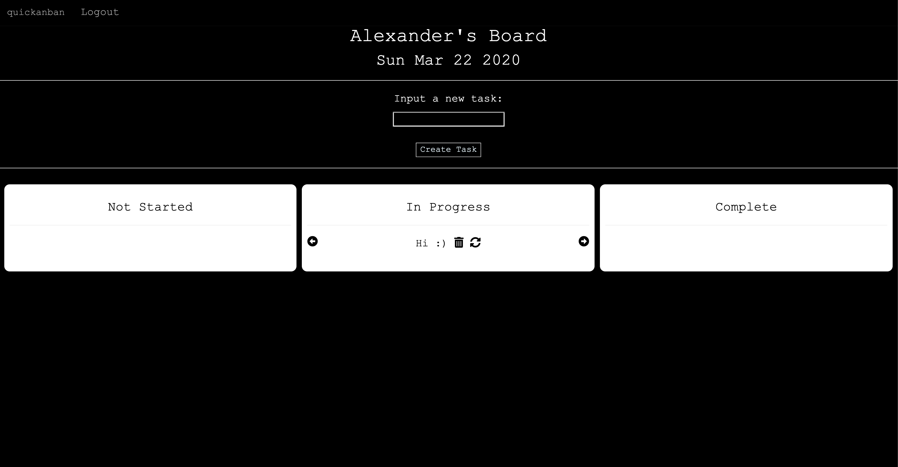

# quickanban
## Web Application Assignment - CS162

***

### Table of Contents
1. [Kanban Functionality](#Kanban-Functionality)
2. [Project Structure](#Project-Structure)
3. [Extra Features](#Extra-Features)
4. [Installation Guide](#Installation-Guide)
5. [Unit Testing](#Unit-Testing)

***

### Layout




***

### Kanban Functionality

**Headers**
1. To Do
2. Doing
3. Done

**Features**
1. Creating a new task.
2. Moving tasks to different states.
3. Deleting tasks.
4. Editing tasks.
5. Blank tasks aren't accepted.
6. User system (Sign Up/Login/Logout) with restrictions (i.e. password > 6 characters).
7. Email validation check.
8. SHA256 hash password protection.
9. Task organization by most recent edit.
10. Personalised board with date.


***

### Project Structure

```
./.DS_Store
./requirements.txt
./__pycache__
  ./__pycache__/app.cpython-37.pyc
./README.md
./.gitignore
./static
  ./static/favicon.ico
  ./static/navbar.css
  ./static/kanban.css
  ./static/signin.css
./app.py
./templates
  ./templates/update.html
  ./templates/index.html
  ./templates/login.html
  ./templates/board.html
  ./templates/signup.html
./test.db
```

***

### Installation Guide

Create a vitrual environment to install our packages (venv):

```bash
python3 -m venv venv
```

Just type into your command line (while in the project's root directory):

```bash
source venv/bin/activate
pip3 install -r requirements.txt
export FLASK_APP=app.py
flask run
```

### To Reset the Database

Go into your directory. In terminal, type

```bash
sqlite3 test.db
.tables
.exit
```

Then open Python and populate the database with columns.

```bash
python3
```
```python3
from app import db
db.create_all()
exit()
```

### Login

There is already a pre-made account in the database with the following details:
Username: username
Password: password

### References

For the login system, https://github.com/PrettyPrinted/building_user_login_system was very helpful.


